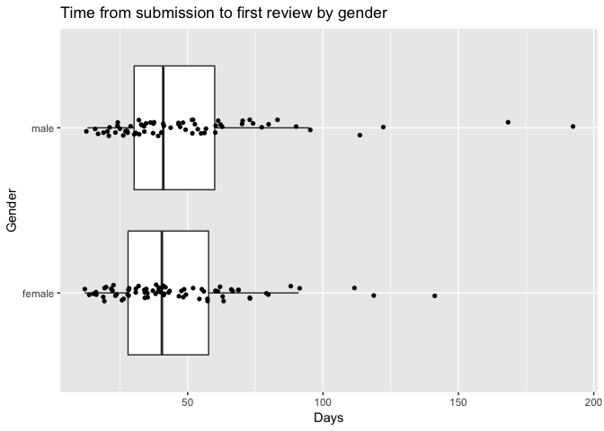

## Introduction
We investigate the publication metadata and related events on the Wellcome Open Research (WOR) publication platform, and consider all 192 publications which have been submitted between 17 October 2016 and 17 November 2017. The exploration is based on the following datasets:

* WOR publication data retrieved from Figshare on 28 November 2017 (Kiley, 2017b).

* Additional bibliographic information and event data from CrossRef and altmetrics data from altmetrics.com retrieved on 28 November 2018 (Jahn, 2017b). 

* Data on F1000Research and WOR review reports and their status parsed from Europe PubMed Central on 10 January 2018 (Jahn, 2018). 

For a summary on key aspects of the WOR dataset also compare Kiley (2017a). Our analysis offers some additional insights.


```
## Joining, by = "URL"
```

## Submissions 
In this section we consider submission rates over time.

<!-- --><!-- --><div data-pagedtable="false">
  <script data-pagedtable-source type="application/json">
{"columns":[{"label":["wday"],"name":[1],"type":["ord"],"align":["right"]},{"label":["submissions"],"name":[2],"type":["int"],"align":["right"]},{"label":["mean"],"name":[3],"type":["dbl"],"align":["right"]}],"data":[{"1":"Sun","2":"10","3":"1.43"},{"1":"Mon","2":"34","3":"1.31"},{"1":"Tue","2":"40","3":"1.38"},{"1":"Wed","2":"38","3":"1.31"},{"1":"Thu","2":"29","3":"1.53"},{"1":"Fri","2":"33","3":"1.43"},{"1":"Sat","2":"8","3":"1.33"}],"options":{"columns":{"min":{},"max":[10]},"rows":{"min":[10],"max":[10]},"pages":{}}}
  </script>
</div>

Overall, 192 submissions were received between 17 October 2016 and 17 November 2017. On average 1.38 submissions were received per day (sd = 0.62), including all versions of the papers -- i.e. about 4 papers every 3 days. No strong patterns could be observed. In absolute terms, the highest number of submissions was received on Tuesdays and the lowest on Saturdays. 

## Article versions and types, references by article type
<div data-pagedtable="false">
  <script data-pagedtable-source type="application/json">
{"columns":[{"label":["Version.Number"],"name":[1],"type":["int"],"align":["right"]},{"label":["n"],"name":[2],"type":["int"],"align":["right"]}],"data":[{"1":"1","2":"142"},{"1":"2","2":"47"},{"1":"3","2":"3"}],"options":{"columns":{"min":{},"max":[10]},"rows":{"min":[10],"max":[10]},"pages":{}}}
  </script>
</div><div data-pagedtable="false">
  <script data-pagedtable-source type="application/json">
{"columns":[{"label":["Article.Type"],"name":[1],"type":["fctr"],"align":["left"]},{"label":["n"],"name":[2],"type":["int"],"align":["right"]},{"label":["min"],"name":[3],"type":["dbl"],"align":["right"]},{"label":["max"],"name":[4],"type":["dbl"],"align":["right"]},{"label":["mean"],"name":[5],"type":["dbl"],"align":["right"]},{"label":["sd"],"name":[6],"type":["dbl"],"align":["right"]}],"data":[{"1":"RESEARCH_ARTICLE","2":"85","3":"7","4":"114","5":"42.19","6":"19.85"},{"1":"METHOD_ARTICLE","2":"13","3":"7","4":"58","5":"28.08","6":"13.29"},{"1":"STUDY_PROTOCOL","2":"10","3":"10","4":"86","5":"34.40","6":"23.28"},{"1":"RESEARCH_NOTE","2":"9","3":"11","4":"36","5":"23.33","6":"8.86"},{"1":"SOFTWARE_TOOLS","2":"8","3":"5","4":"29","5":"14.00","6":"9.56"},{"1":"DATA_NOTE","2":"7","3":"7","4":"51","5":"22.86","6":"15.73"},{"1":"SYSTEMATIC_REVIEW","2":"4","3":"21","4":"100","5":"45.00","6":"36.89"},{"1":"OPEN_LETTER","2":"2","3":"17","4":"21","5":"19.00","6":"2.83"},{"1":"CASE_REPORT","2":"1","3":"27","4":"27","5":"27.00","6":"NA"}],"options":{"columns":{"min":{},"max":[10]},"rows":{"min":[10],"max":[10]},"pages":{}}}
  </script>
</div>

Several article types can be published on Wellcome Open Research. So far about 3 out of 5 of all articles are research articles (88 articles, 61.97%), followed by method articles (13 articles, 9.15%), study protocols (10 articles, 7.04%), and several smaller categories.

Of the 142 papers published on Wellcome Open Research by end of November 2017, 95 papers have only one version, 47 have two versions and 3 papers have three versions. 

The rate of papers with only one version seems to be rather high. This might be partially due to the fact that for some papers the review-revise process has not been closed. However, the high rate may also be due to the fact that post-publication review is applied, i.e. the paper is already published when the reviews come in and therefore the motivation to revise the paper is lower than in pre-publication review processes. In addition, a higher rate of revisions can be expected if review reports recommend revisions or do not approve the given version of the paper.  

## Number of authors & gender 
<div data-pagedtable="false">
  <script data-pagedtable-source type="application/json">
{"columns":[{"label":["min"],"name":[1],"type":["dbl"],"align":["right"]},{"label":["max"],"name":[2],"type":["dbl"],"align":["right"]},{"label":["mean"],"name":[3],"type":["dbl"],"align":["right"]},{"label":["sd"],"name":[4],"type":["dbl"],"align":["right"]}],"data":[{"1":"1","2":"31","3":"7.87","4":"5.51"}],"options":{"columns":{"min":{},"max":[10]},"rows":{"min":[10],"max":[10]},"pages":{}}}
  </script>
</div><div data-pagedtable="false">
  <script data-pagedtable-source type="application/json">
{"columns":[{"label":["name"],"name":[1],"type":["chr"],"align":["left"]},{"label":["proportion_male"],"name":[2],"type":["dbl"],"align":["right"]},{"label":["proportion_female"],"name":[3],"type":["dbl"],"align":["right"]},{"label":["gender"],"name":[4],"type":["chr"],"align":["left"]},{"label":["year_min"],"name":[5],"type":["dbl"],"align":["right"]},{"label":["year_max"],"name":[6],"type":["dbl"],"align":["right"]}],"data":[{"1":"Aaron","2":"0.9918","3":"0.0082","4":"male","5":"1932","6":"2012"},{"1":"Abdirahman","2":"1.0000","3":"0.0000","4":"male","5":"1932","6":"2012"},{"1":"Abdoulaye","2":"1.0000","3":"0.0000","4":"male","5":"1932","6":"2012"},{"1":"Abigale","2":"0.0000","3":"1.0000","4":"female","5":"1932","6":"2012"},{"1":"Abraham","2":"0.9969","3":"0.0031","4":"male","5":"1932","6":"2012"},{"1":"Adam","2":"0.9959","3":"0.0041","4":"male","5":"1932","6":"2012"},{"1":"Adenike","2":"0.0000","3":"1.0000","4":"female","5":"1932","6":"2012"},{"1":"Alan","2":"0.9968","3":"0.0032","4":"male","5":"1932","6":"2012"},{"1":"Alastair","2":"1.0000","3":"0.0000","4":"male","5":"1932","6":"2012"},{"1":"Albert","2":"0.9944","3":"0.0056","4":"male","5":"1932","6":"2012"},{"1":"Alex","2":"0.9657","3":"0.0343","4":"male","5":"1932","6":"2012"},{"1":"Alex","2":"0.9657","3":"0.0343","4":"male","5":"1932","6":"2012"},{"1":"Alex","2":"0.9657","3":"0.0343","4":"male","5":"1932","6":"2012"},{"1":"Alexa","2":"0.0021","3":"0.9979","4":"female","5":"1932","6":"2012"},{"1":"Alexey","2":"0.9296","3":"0.0704","4":"male","5":"1932","6":"2012"},{"1":"Alexis","2":"0.1452","3":"0.8548","4":"female","5":"1932","6":"2012"},{"1":"Alfred","2":"0.9942","3":"0.0058","4":"male","5":"1932","6":"2012"},{"1":"Alice","2":"0.0034","3":"0.9966","4":"female","5":"1932","6":"2012"},{"1":"Alice","2":"0.0034","3":"0.9966","4":"female","5":"1932","6":"2012"},{"1":"Alireza","2":"1.0000","3":"0.0000","4":"male","5":"1932","6":"2012"},{"1":"Allison","2":"0.0082","3":"0.9918","4":"female","5":"1932","6":"2012"},{"1":"Amanda","2":"0.0026","3":"0.9974","4":"female","5":"1932","6":"2012"},{"1":"Amna","2":"0.0000","3":"1.0000","4":"female","5":"1932","6":"2012"},{"1":"Amna","2":"0.0000","3":"1.0000","4":"female","5":"1932","6":"2012"},{"1":"Amy","2":"0.0026","3":"0.9974","4":"female","5":"1932","6":"2012"},{"1":"Amy","2":"0.0026","3":"0.9974","4":"female","5":"1932","6":"2012"},{"1":"Amy","2":"0.0026","3":"0.9974","4":"female","5":"1932","6":"2012"},{"1":"Ananda","2":"0.0400","3":"0.9600","4":"female","5":"1932","6":"2012"},{"1":"Andrei","2":"1.0000","3":"0.0000","4":"male","5":"1932","6":"2012"},{"1":"Andrew","2":"0.9960","3":"0.0040","4":"male","5":"1932","6":"2012"},{"1":"Andrew","2":"0.9960","3":"0.0040","4":"male","5":"1932","6":"2012"},{"1":"Andrew","2":"0.9960","3":"0.0040","4":"male","5":"1932","6":"2012"},{"1":"Andy","2":"0.9881","3":"0.0119","4":"male","5":"1932","6":"2012"},{"1":"Angela","2":"0.0030","3":"0.9970","4":"female","5":"1932","6":"2012"},{"1":"Angela","2":"0.0030","3":"0.9970","4":"female","5":"1932","6":"2012"},{"1":"Ann","2":"0.0027","3":"0.9973","4":"female","5":"1932","6":"2012"},{"1":"Ann","2":"0.0027","3":"0.9973","4":"female","5":"1932","6":"2012"},{"1":"Ann","2":"0.0027","3":"0.9973","4":"female","5":"1932","6":"2012"},{"1":"Anna","2":"0.0029","3":"0.9971","4":"female","5":"1932","6":"2012"},{"1":"Anna","2":"0.0029","3":"0.9971","4":"female","5":"1932","6":"2012"},{"1":"Anna","2":"0.0029","3":"0.9971","4":"female","5":"1932","6":"2012"},{"1":"Anna","2":"0.0029","3":"0.9971","4":"female","5":"1932","6":"2012"},{"1":"Anna","2":"0.0029","3":"0.9971","4":"female","5":"1932","6":"2012"},{"1":"Anne","2":"0.0025","3":"0.9975","4":"female","5":"1932","6":"2012"},{"1":"Annemarie","2":"0.0000","3":"1.0000","4":"female","5":"1932","6":"2012"},{"1":"Annemarie","2":"0.0000","3":"1.0000","4":"female","5":"1932","6":"2012"},{"1":"Anthony","2":"0.9946","3":"0.0054","4":"male","5":"1932","6":"2012"},{"1":"Anthony","2":"0.9946","3":"0.0054","4":"male","5":"1932","6":"2012"},{"1":"Antonella","2":"0.0000","3":"1.0000","4":"female","5":"1932","6":"2012"},{"1":"Antonia","2":"0.0875","3":"0.9125","4":"female","5":"1932","6":"2012"},{"1":"Antony","2":"1.0000","3":"0.0000","4":"male","5":"1932","6":"2012"},{"1":"Antony","2":"1.0000","3":"0.0000","4":"male","5":"1932","6":"2012"},{"1":"Aravind","2":"1.0000","3":"0.0000","4":"male","5":"1932","6":"2012"},{"1":"Archie","2":"0.9780","3":"0.0220","4":"male","5":"1932","6":"2012"},{"1":"Arvind","2":"1.0000","3":"0.0000","4":"male","5":"1932","6":"2012"},{"1":"Aviva","2":"0.0000","3":"1.0000","4":"female","5":"1932","6":"2012"},{"1":"Ayub","2":"1.0000","3":"0.0000","4":"male","5":"1932","6":"2012"},{"1":"Barbara","2":"0.0027","3":"0.9973","4":"female","5":"1932","6":"2012"},{"1":"Bassirou","2":"1.0000","3":"0.0000","4":"male","5":"1932","6":"2012"},{"1":"Beatrice","2":"0.0034","3":"0.9966","4":"female","5":"1932","6":"2012"},{"1":"Ben","2":"0.9960","3":"0.0040","4":"male","5":"1932","6":"2012"},{"1":"Ben","2":"0.9960","3":"0.0040","4":"male","5":"1932","6":"2012"},{"1":"Ben","2":"0.9960","3":"0.0040","4":"male","5":"1932","6":"2012"},{"1":"Benard","2":"1.0000","3":"0.0000","4":"male","5":"1932","6":"2012"},{"1":"Benard","2":"1.0000","3":"0.0000","4":"male","5":"1932","6":"2012"},{"1":"Benjamin","2":"0.9962","3":"0.0038","4":"male","5":"1932","6":"2012"},{"1":"Benoit","2":"1.0000","3":"0.0000","4":"male","5":"1932","6":"2012"},{"1":"Bernadette","2":"0.0012","3":"0.9988","4":"female","5":"1932","6":"2012"},{"1":"Bethan","2":"0.0000","3":"1.0000","4":"female","5":"1932","6":"2012"},{"1":"Boniface","2":"1.0000","3":"0.0000","4":"male","5":"1932","6":"2012"},{"1":"Braun","2":"1.0000","3":"0.0000","4":"male","5":"1932","6":"2012"},{"1":"Brett","2":"0.9786","3":"0.0214","4":"male","5":"1932","6":"2012"},{"1":"Bridie","2":"0.0000","3":"1.0000","4":"female","5":"1932","6":"2012"},{"1":"Bryony","2":"0.0000","3":"1.0000","4":"female","5":"1932","6":"2012"},{"1":"Caroline","2":"0.0015","3":"0.9985","4":"female","5":"1932","6":"2012"},{"1":"Caroline","2":"0.0015","3":"0.9985","4":"female","5":"1932","6":"2012"},{"1":"Caroline","2":"0.0015","3":"0.9985","4":"female","5":"1932","6":"2012"},{"1":"Caroline","2":"0.0015","3":"0.9985","4":"female","5":"1932","6":"2012"},{"1":"Catherine","2":"0.0027","3":"0.9973","4":"female","5":"1932","6":"2012"},{"1":"Catherine","2":"0.0027","3":"0.9973","4":"female","5":"1932","6":"2012"},{"1":"Catherine","2":"0.0027","3":"0.9973","4":"female","5":"1932","6":"2012"},{"1":"Catherine","2":"0.0027","3":"0.9973","4":"female","5":"1932","6":"2012"},{"1":"Catherine","2":"0.0027","3":"0.9973","4":"female","5":"1932","6":"2012"},{"1":"Catherine","2":"0.0027","3":"0.9973","4":"female","5":"1932","6":"2012"},{"1":"Catherine","2":"0.0027","3":"0.9973","4":"female","5":"1932","6":"2012"},{"1":"Cathie","2":"0.0000","3":"1.0000","4":"female","5":"1932","6":"2012"},{"1":"Catriona","2":"0.0000","3":"1.0000","4":"female","5":"1932","6":"2012"},{"1":"Celia","2":"0.0012","3":"0.9988","4":"female","5":"1932","6":"2012"},{"1":"Chan","2":"0.8023","3":"0.1977","4":"male","5":"1932","6":"2012"},{"1":"Charles","2":"0.9949","3":"0.0051","4":"male","5":"1932","6":"2012"},{"1":"Charles","2":"0.9949","3":"0.0051","4":"male","5":"1932","6":"2012"},{"1":"Charlie","2":"0.8819","3":"0.1181","4":"male","5":"1932","6":"2012"},{"1":"Chea","2":"0.1503","3":"0.8497","4":"female","5":"1932","6":"2012"},{"1":"Chetan","2":"1.0000","3":"0.0000","4":"male","5":"1932","6":"2012"},{"1":"Christabel","2":"0.0000","3":"1.0000","4":"female","5":"1932","6":"2012"},{"1":"Christina","2":"0.0040","3":"0.9960","4":"female","5":"1932","6":"2012"},{"1":"Christina","2":"0.0040","3":"0.9960","4":"female","5":"1932","6":"2012"},{"1":"Christina","2":"0.0040","3":"0.9960","4":"female","5":"1932","6":"2012"},{"1":"Christoph","2":"1.0000","3":"0.0000","4":"male","5":"1932","6":"2012"},{"1":"Christoph","2":"1.0000","3":"0.0000","4":"male","5":"1932","6":"2012"},{"1":"Christopher","2":"0.9950","3":"0.0050","4":"male","5":"1932","6":"2012"},{"1":"Christopher","2":"0.9950","3":"0.0050","4":"male","5":"1932","6":"2012"},{"1":"Clare","2":"0.0469","3":"0.9531","4":"female","5":"1932","6":"2012"},{"1":"Clare","2":"0.0469","3":"0.9531","4":"female","5":"1932","6":"2012"},{"1":"Claudia","2":"0.0051","3":"0.9949","4":"female","5":"1932","6":"2012"},{"1":"Clifford","2":"0.9931","3":"0.0069","4":"male","5":"1932","6":"2012"},{"1":"Colette","2":"0.0000","3":"1.0000","4":"female","5":"1932","6":"2012"},{"1":"Corey","2":"0.9502","3":"0.0498","4":"male","5":"1932","6":"2012"},{"1":"Cristina","2":"0.0051","3":"0.9949","4":"female","5":"1932","6":"2012"},{"1":"Dang","2":"0.9788","3":"0.0212","4":"male","5":"1932","6":"2012"},{"1":"Daniel","2":"0.9954","3":"0.0046","4":"male","5":"1932","6":"2012"},{"1":"Daniel","2":"0.9954","3":"0.0046","4":"male","5":"1932","6":"2012"},{"1":"Daniel","2":"0.9954","3":"0.0046","4":"male","5":"1932","6":"2012"},{"1":"Daniel","2":"0.9954","3":"0.0046","4":"male","5":"1932","6":"2012"},{"1":"Danielle","2":"0.0049","3":"0.9951","4":"female","5":"1932","6":"2012"},{"1":"Danielle","2":"0.0049","3":"0.9951","4":"female","5":"1932","6":"2012"},{"1":"Dardan","2":"1.0000","3":"0.0000","4":"male","5":"1932","6":"2012"},{"1":"Darren","2":"0.9940","3":"0.0060","4":"male","5":"1932","6":"2012"},{"1":"David","2":"0.9963","3":"0.0037","4":"male","5":"1932","6":"2012"},{"1":"David","2":"0.9963","3":"0.0037","4":"male","5":"1932","6":"2012"},{"1":"David","2":"0.9963","3":"0.0037","4":"male","5":"1932","6":"2012"},{"1":"David","2":"0.9963","3":"0.0037","4":"male","5":"1932","6":"2012"},{"1":"David","2":"0.9963","3":"0.0037","4":"male","5":"1932","6":"2012"},{"1":"David","2":"0.9963","3":"0.0037","4":"male","5":"1932","6":"2012"},{"1":"David","2":"0.9963","3":"0.0037","4":"male","5":"1932","6":"2012"},{"1":"David","2":"0.9963","3":"0.0037","4":"male","5":"1932","6":"2012"},{"1":"David","2":"0.9963","3":"0.0037","4":"male","5":"1932","6":"2012"},{"1":"David","2":"0.9963","3":"0.0037","4":"male","5":"1932","6":"2012"},{"1":"David","2":"0.9963","3":"0.0037","4":"male","5":"1932","6":"2012"},{"1":"David","2":"0.9963","3":"0.0037","4":"male","5":"1932","6":"2012"},{"1":"David","2":"0.9963","3":"0.0037","4":"male","5":"1932","6":"2012"},{"1":"Deborah","2":"0.0021","3":"0.9979","4":"female","5":"1932","6":"2012"},{"1":"Demetris","2":"0.7199","3":"0.2801","4":"male","5":"1932","6":"2012"},{"1":"Dianne","2":"0.0019","3":"0.9981","4":"female","5":"1932","6":"2012"},{"1":"Diego","2":"0.9977","3":"0.0023","4":"male","5":"1932","6":"2012"},{"1":"Dmitry","2":"1.0000","3":"0.0000","4":"male","5":"1932","6":"2012"},{"1":"Dmitry","2":"1.0000","3":"0.0000","4":"male","5":"1932","6":"2012"},{"1":"Dominic","2":"0.9907","3":"0.0093","4":"male","5":"1932","6":"2012"},{"1":"Dominic","2":"0.9907","3":"0.0093","4":"male","5":"1932","6":"2012"},{"1":"Dominique","2":"0.2884","3":"0.7116","4":"female","5":"1932","6":"2012"},{"1":"Doris","2":"0.0069","3":"0.9931","4":"female","5":"1932","6":"2012"},{"1":"Dorota","2":"0.0000","3":"1.0000","4":"female","5":"1932","6":"2012"},{"1":"Douglas","2":"0.9965","3":"0.0035","4":"male","5":"1932","6":"2012"},{"1":"Ed","2":"0.9995","3":"0.0005","4":"male","5":"1932","6":"2012"},{"1":"Edith","2":"0.0032","3":"0.9968","4":"female","5":"1932","6":"2012"},{"1":"Edith","2":"0.0032","3":"0.9968","4":"female","5":"1932","6":"2012"},{"1":"Eh","2":"0.5687","3":"0.4313","4":"male","5":"1932","6":"2012"},{"1":"Eimear","2":"0.0000","3":"1.0000","4":"female","5":"1932","6":"2012"},{"1":"Eleanor","2":"0.0021","3":"0.9979","4":"female","5":"1932","6":"2012"},{"1":"Eleri","2":"0.0000","3":"1.0000","4":"female","5":"1932","6":"2012"},{"1":"Elisa","2":"0.0030","3":"0.9970","4":"female","5":"1932","6":"2012"},{"1":"Elisabeth","2":"0.0007","3":"0.9993","4":"female","5":"1932","6":"2012"},{"1":"Elise","2":"0.0006","3":"0.9994","4":"female","5":"1932","6":"2012"},{"1":"Elise","2":"0.0006","3":"0.9994","4":"female","5":"1932","6":"2012"},{"1":"Elizabeth","2":"0.0031","3":"0.9969","4":"female","5":"1932","6":"2012"},{"1":"Elizabeth","2":"0.0031","3":"0.9969","4":"female","5":"1932","6":"2012"},{"1":"Elizabeth","2":"0.0031","3":"0.9969","4":"female","5":"1932","6":"2012"},{"1":"Elizabeth","2":"0.0031","3":"0.9969","4":"female","5":"1932","6":"2012"},{"1":"Ellie","2":"0.0133","3":"0.9867","4":"female","5":"1932","6":"2012"},{"1":"Elsi","2":"0.0000","3":"1.0000","4":"female","5":"1932","6":"2012"},{"1":"Emanuele","2":"1.0000","3":"0.0000","4":"male","5":"1932","6":"2012"},{"1":"Emanuele","2":"1.0000","3":"0.0000","4":"male","5":"1932","6":"2012"},{"1":"Emanuele","2":"1.0000","3":"0.0000","4":"male","5":"1932","6":"2012"},{"1":"Emilie","2":"0.0004","3":"0.9996","4":"female","5":"1932","6":"2012"},{"1":"Emily","2":"0.0021","3":"0.9979","4":"female","5":"1932","6":"2012"},{"1":"Emily","2":"0.0021","3":"0.9979","4":"female","5":"1932","6":"2012"},{"1":"Emma","2":"0.0021","3":"0.9979","4":"female","5":"1932","6":"2012"},{"1":"Emma","2":"0.0021","3":"0.9979","4":"female","5":"1932","6":"2012"},{"1":"Emma","2":"0.0021","3":"0.9979","4":"female","5":"1932","6":"2012"},{"1":"Emma","2":"0.0021","3":"0.9979","4":"female","5":"1932","6":"2012"},{"1":"Emma","2":"0.0021","3":"0.9979","4":"female","5":"1932","6":"2012"},{"1":"Emmanuel","2":"0.9943","3":"0.0057","4":"male","5":"1932","6":"2012"},{"1":"Emyr","2":"1.0000","3":"0.0000","4":"male","5":"1932","6":"2012"},{"1":"Enock","2":"1.0000","3":"0.0000","4":"male","5":"1932","6":"2012"},{"1":"Eric","2":"0.9947","3":"0.0053","4":"male","5":"1932","6":"2012"},{"1":"Eric","2":"0.9947","3":"0.0053","4":"male","5":"1932","6":"2012"},{"1":"Erin","2":"0.0267","3":"0.9733","4":"female","5":"1932","6":"2012"},{"1":"Esmael","2":"1.0000","3":"0.0000","4":"male","5":"1932","6":"2012"},{"1":"Esther","2":"0.0039","3":"0.9961","4":"female","5":"1932","6":"2012"},{"1":"Esther","2":"0.0039","3":"0.9961","4":"female","5":"1932","6":"2012"},{"1":"Esther","2":"0.0039","3":"0.9961","4":"female","5":"1932","6":"2012"},{"1":"Fabian","2":"0.9896","3":"0.0104","4":"male","5":"1932","6":"2012"},{"1":"Fabrice","2":"1.0000","3":"0.0000","4":"male","5":"1932","6":"2012"},{"1":"Federica","2":"0.0000","3":"1.0000","4":"female","5":"1932","6":"2012"},{"1":"Fergus","2":"1.0000","3":"0.0000","4":"male","5":"1932","6":"2012"},{"1":"Fiona","2":"0.0003","3":"0.9997","4":"female","5":"1932","6":"2012"},{"1":"Fiona","2":"0.0003","3":"0.9997","4":"female","5":"1932","6":"2012"},{"1":"Fiona","2":"0.0003","3":"0.9997","4":"female","5":"1932","6":"2012"},{"1":"Francesco","2":"1.0000","3":"0.0000","4":"male","5":"1932","6":"2012"},{"1":"Francis","2":"0.9125","3":"0.0875","4":"male","5":"1932","6":"2012"},{"1":"Francois","2":"0.9963","3":"0.0037","4":"male","5":"1932","6":"2012"},{"1":"Frank","2":"0.9953","3":"0.0047","4":"male","5":"1932","6":"2012"},{"1":"Gabrielle","2":"0.0052","3":"0.9948","4":"female","5":"1932","6":"2012"},{"1":"Gail","2":"0.0264","3":"0.9736","4":"female","5":"1932","6":"2012"},{"1":"Gail","2":"0.0264","3":"0.9736","4":"female","5":"1932","6":"2012"},{"1":"Gail","2":"0.0264","3":"0.9736","4":"female","5":"1932","6":"2012"},{"1":"Garan","2":"1.0000","3":"0.0000","4":"male","5":"1932","6":"2012"},{"1":"Gareth","2":"0.9984","3":"0.0016","4":"male","5":"1932","6":"2012"},{"1":"Gary","2":"0.9962","3":"0.0038","4":"male","5":"1932","6":"2012"},{"1":"Gauri","2":"0.0000","3":"1.0000","4":"female","5":"1932","6":"2012"},{"1":"Gavin","2":"0.9975","3":"0.0025","4":"male","5":"1932","6":"2012"},{"1":"Genevieve","2":"0.0008","3":"0.9992","4":"female","5":"1932","6":"2012"},{"1":"George","2":"0.9932","3":"0.0068","4":"male","5":"1932","6":"2012"},{"1":"George","2":"0.9932","3":"0.0068","4":"male","5":"1932","6":"2012"},{"1":"George","2":"0.9932","3":"0.0068","4":"male","5":"1932","6":"2012"},{"1":"George","2":"0.9932","3":"0.0068","4":"male","5":"1932","6":"2012"},{"1":"George","2":"0.9932","3":"0.0068","4":"male","5":"1932","6":"2012"},{"1":"George","2":"0.9932","3":"0.0068","4":"male","5":"1932","6":"2012"},{"1":"Giles","2":"1.0000","3":"0.0000","4":"male","5":"1932","6":"2012"},{"1":"Gill","2":"0.9502","3":"0.0498","4":"male","5":"1932","6":"2012"},{"1":"Gilles","2":"1.0000","3":"0.0000","4":"male","5":"1932","6":"2012"},{"1":"Giovanna","2":"0.0000","3":"1.0000","4":"female","5":"1932","6":"2012"},{"1":"Grace","2":"0.0021","3":"0.9979","4":"female","5":"1932","6":"2012"},{"1":"Greg","2":"0.9980","3":"0.0020","4":"male","5":"1932","6":"2012"},{"1":"Gurman","2":"0.9228","3":"0.0772","4":"male","5":"1932","6":"2012"},{"1":"Gustav","2":"1.0000","3":"0.0000","4":"male","5":"1932","6":"2012"},{"1":"Guy","2":"0.9959","3":"0.0041","4":"male","5":"1932","6":"2012"},{"1":"Guy","2":"0.9959","3":"0.0041","4":"male","5":"1932","6":"2012"},{"1":"Haleema","2":"0.0000","3":"1.0000","4":"female","5":"1932","6":"2012"},{"1":"Haleema","2":"0.0000","3":"1.0000","4":"female","5":"1932","6":"2012"},{"1":"Haleema","2":"0.0000","3":"1.0000","4":"female","5":"1932","6":"2012"},{"1":"Hamilton","2":"1.0000","3":"0.0000","4":"male","5":"1932","6":"2012"},{"1":"Hannah","2":"0.0016","3":"0.9984","4":"female","5":"1932","6":"2012"},{"1":"Hannah","2":"0.0016","3":"0.9984","4":"female","5":"1932","6":"2012"},{"1":"Harriet","2":"0.0011","3":"0.9989","4":"female","5":"1932","6":"2012"},{"1":"Harriet","2":"0.0011","3":"0.9989","4":"female","5":"1932","6":"2012"},{"1":"Harriett","2":"0.0005","3":"0.9995","4":"female","5":"1932","6":"2012"},{"1":"Heike","2":"0.0000","3":"1.0000","4":"female","5":"1932","6":"2012"},{"1":"Helen","2":"0.0037","3":"0.9963","4":"female","5":"1932","6":"2012"},{"1":"Helen","2":"0.0037","3":"0.9963","4":"female","5":"1932","6":"2012"},{"1":"Helen","2":"0.0037","3":"0.9963","4":"female","5":"1932","6":"2012"},{"1":"Helen","2":"0.0037","3":"0.9963","4":"female","5":"1932","6":"2012"},{"1":"Hellen","2":"0.0000","3":"1.0000","4":"female","5":"1932","6":"2012"},{"1":"Ho","2":"1.0000","3":"0.0000","4":"male","5":"1932","6":"2012"},{"1":"Howard","2":"0.9955","3":"0.0045","4":"male","5":"1932","6":"2012"},{"1":"Ian","2":"0.9962","3":"0.0038","4":"male","5":"1932","6":"2012"},{"1":"Ian","2":"0.9962","3":"0.0038","4":"male","5":"1932","6":"2012"},{"1":"Ian","2":"0.9962","3":"0.0038","4":"male","5":"1932","6":"2012"},{"1":"Ian","2":"0.9962","3":"0.0038","4":"male","5":"1932","6":"2012"},{"1":"Ignacio","2":"0.9989","3":"0.0011","4":"male","5":"1932","6":"2012"},{"1":"Ilias","2":"1.0000","3":"0.0000","4":"male","5":"1932","6":"2012"},{"1":"Ilir","2":"1.0000","3":"0.0000","4":"male","5":"1932","6":"2012"},{"1":"Imran","2":"1.0000","3":"0.0000","4":"male","5":"1932","6":"2012"},{"1":"Imran","2":"1.0000","3":"0.0000","4":"male","5":"1932","6":"2012"},{"1":"Ingrid","2":"0.0007","3":"0.9993","4":"female","5":"1932","6":"2012"},{"1":"Innocent","2":"1.0000","3":"0.0000","4":"male","5":"1932","6":"2012"},{"1":"Innocent","2":"1.0000","3":"0.0000","4":"male","5":"1932","6":"2012"},{"1":"Irene","2":"0.0040","3":"0.9960","4":"female","5":"1932","6":"2012"},{"1":"Irene","2":"0.0040","3":"0.9960","4":"female","5":"1932","6":"2012"},{"1":"Irene","2":"0.0040","3":"0.9960","4":"female","5":"1932","6":"2012"},{"1":"Irina","2":"0.0000","3":"1.0000","4":"female","5":"1932","6":"2012"},{"1":"Isabella","2":"0.0012","3":"0.9988","4":"female","5":"1932","6":"2012"},{"1":"Jack","2":"0.9969","3":"0.0031","4":"male","5":"1932","6":"2012"},{"1":"Jacob","2":"0.9973","3":"0.0027","4":"male","5":"1932","6":"2012"},{"1":"Jacob","2":"0.9973","3":"0.0027","4":"male","5":"1932","6":"2012"},{"1":"Jacob","2":"0.9973","3":"0.0027","4":"male","5":"1932","6":"2012"},{"1":"Jacqui","2":"0.0139","3":"0.9861","4":"female","5":"1932","6":"2012"},{"1":"Jagdeep","2":"1.0000","3":"0.0000","4":"male","5":"1932","6":"2012"},{"1":"James","2":"0.9956","3":"0.0044","4":"male","5":"1932","6":"2012"},{"1":"James","2":"0.9956","3":"0.0044","4":"male","5":"1932","6":"2012"},{"1":"James","2":"0.9956","3":"0.0044","4":"male","5":"1932","6":"2012"},{"1":"Jamie","2":"0.2295","3":"0.7705","4":"female","5":"1932","6":"2012"},{"1":"Jamie","2":"0.2295","3":"0.7705","4":"female","5":"1932","6":"2012"},{"1":"Jane","2":"0.0029","3":"0.9971","4":"female","5":"1932","6":"2012"},{"1":"Jane","2":"0.0029","3":"0.9971","4":"female","5":"1932","6":"2012"},{"1":"Jane","2":"0.0029","3":"0.9971","4":"female","5":"1932","6":"2012"},{"1":"Jane","2":"0.0029","3":"0.9971","4":"female","5":"1932","6":"2012"},{"1":"Janet","2":"0.0026","3":"0.9974","4":"female","5":"1932","6":"2012"},{"1":"Janette","2":"0.0014","3":"0.9986","4":"female","5":"1932","6":"2012"},{"1":"Janis","2":"0.0032","3":"0.9968","4":"female","5":"1932","6":"2012"},{"1":"Japhet","2":"1.0000","3":"0.0000","4":"male","5":"1932","6":"2012"},{"1":"Jasmin","2":"0.0130","3":"0.9870","4":"female","5":"1932","6":"2012"},{"1":"Jason","2":"0.9948","3":"0.0052","4":"male","5":"1932","6":"2012"},{"1":"Jason","2":"0.9948","3":"0.0052","4":"male","5":"1932","6":"2012"},{"1":"Jean","2":"0.0556","3":"0.9444","4":"female","5":"1932","6":"2012"},{"1":"Jennifer","2":"0.0031","3":"0.9969","4":"female","5":"1932","6":"2012"},{"1":"Jennifer","2":"0.0031","3":"0.9969","4":"female","5":"1932","6":"2012"},{"1":"Jennifer","2":"0.0031","3":"0.9969","4":"female","5":"1932","6":"2012"},{"1":"Jeremy","2":"0.9943","3":"0.0057","4":"male","5":"1932","6":"2012"},{"1":"Jeremy","2":"0.9943","3":"0.0057","4":"male","5":"1932","6":"2012"},{"1":"Jessica","2":"0.0032","3":"0.9968","4":"female","5":"1932","6":"2012"},{"1":"Jessy","2":"0.7079","3":"0.2921","4":"male","5":"1932","6":"2012"},{"1":"Jia","2":"0.1851","3":"0.8149","4":"female","5":"1932","6":"2012"},{"1":"Jian","2":"0.9808","3":"0.0192","4":"male","5":"1932","6":"2012"},{"1":"Jill","2":"0.0023","3":"0.9977","4":"female","5":"1932","6":"2012"},{"1":"Jin","2":"0.7081","3":"0.2919","4":"male","5":"1932","6":"2012"},{"1":"Joanna","2":"0.0031","3":"0.9969","4":"female","5":"1932","6":"2012"},{"1":"Joanna","2":"0.0031","3":"0.9969","4":"female","5":"1932","6":"2012"},{"1":"Joao","2":"1.0000","3":"0.0000","4":"male","5":"1932","6":"2012"},{"1":"Joe","2":"0.9745","3":"0.0255","4":"male","5":"1932","6":"2012"},{"1":"Johanna","2":"0.0031","3":"0.9969","4":"female","5":"1932","6":"2012"},{"1":"Johanna","2":"0.0031","3":"0.9969","4":"female","5":"1932","6":"2012"},{"1":"Johannes","2":"1.0000","3":"0.0000","4":"male","5":"1932","6":"2012"},{"1":"John","2":"0.9961","3":"0.0039","4":"male","5":"1932","6":"2012"},{"1":"Jonathan","2":"0.9954","3":"0.0046","4":"male","5":"1932","6":"2012"},{"1":"Jordi","2":"0.9403","3":"0.0597","4":"male","5":"1932","6":"2012"},{"1":"Jordi","2":"0.9403","3":"0.0597","4":"male","5":"1932","6":"2012"},{"1":"Jorge","2":"0.9940","3":"0.0060","4":"male","5":"1932","6":"2012"},{"1":"Joseph","2":"0.9958","3":"0.0042","4":"male","5":"1932","6":"2012"},{"1":"Joseph","2":"0.9958","3":"0.0042","4":"male","5":"1932","6":"2012"},{"1":"Joseph","2":"0.9958","3":"0.0042","4":"male","5":"1932","6":"2012"},{"1":"Joseph","2":"0.9958","3":"0.0042","4":"male","5":"1932","6":"2012"},{"1":"Joseph","2":"0.9958","3":"0.0042","4":"male","5":"1932","6":"2012"},{"1":"Joshua","2":"0.9956","3":"0.0044","4":"male","5":"1932","6":"2012"},{"1":"Juan","2":"0.9916","3":"0.0084","4":"male","5":"1932","6":"2012"},{"1":"Juan","2":"0.9916","3":"0.0084","4":"male","5":"1932","6":"2012"},{"1":"Julia","2":"0.0036","3":"0.9964","4":"female","5":"1932","6":"2012"},{"1":"Julian","2":"0.9824","3":"0.0176","4":"male","5":"1932","6":"2012"},{"1":"Julian","2":"0.9824","3":"0.0176","4":"male","5":"1932","6":"2012"},{"1":"Julie","2":"0.0027","3":"0.9973","4":"female","5":"1932","6":"2012"},{"1":"Julien","2":"0.9774","3":"0.0226","4":"male","5":"1932","6":"2012"},{"1":"Juri","2":"0.0503","3":"0.9497","4":"female","5":"1932","6":"2012"},{"1":"Juri","2":"0.0503","3":"0.9497","4":"female","5":"1932","6":"2012"},{"1":"Juri","2":"0.0503","3":"0.9497","4":"female","5":"1932","6":"2012"},{"1":"Justyna","2":"0.0000","3":"1.0000","4":"female","5":"1932","6":"2012"},{"1":"Jyoti","2":"0.0000","3":"1.0000","4":"female","5":"1932","6":"2012"},{"1":"Kailey","2":"0.0004","3":"0.9996","4":"female","5":"1932","6":"2012"},{"1":"Kanchan","2":"0.0000","3":"1.0000","4":"female","5":"1932","6":"2012"},{"1":"Kara","2":"0.0027","3":"0.9973","4":"female","5":"1932","6":"2012"},{"1":"Karin","2":"0.0045","3":"0.9955","4":"female","5":"1932","6":"2012"},{"1":"Kastriot","2":"1.0000","3":"0.0000","4":"male","5":"1932","6":"2012"},{"1":"Kastriot","2":"1.0000","3":"0.0000","4":"male","5":"1932","6":"2012"},{"1":"Katharine","2":"0.0003","3":"0.9997","4":"female","5":"1932","6":"2012"},{"1":"Katherine","2":"0.0028","3":"0.9972","4":"female","5":"1932","6":"2012"},{"1":"Kathryn","2":"0.0025","3":"0.9975","4":"female","5":"1932","6":"2012"},{"1":"Kathryn","2":"0.0025","3":"0.9975","4":"female","5":"1932","6":"2012"},{"1":"Kathryn","2":"0.0025","3":"0.9975","4":"female","5":"1932","6":"2012"},{"1":"Kathryn","2":"0.0025","3":"0.9975","4":"female","5":"1932","6":"2012"},{"1":"Kathy","2":"0.0021","3":"0.9979","4":"female","5":"1932","6":"2012"},{"1":"Katie","2":"0.0020","3":"0.9980","4":"female","5":"1932","6":"2012"},{"1":"Katie","2":"0.0020","3":"0.9980","4":"female","5":"1932","6":"2012"},{"1":"Kayleigh","2":"0.0003","3":"0.9997","4":"female","5":"1932","6":"2012"},{"1":"Ke","2":"1.0000","3":"0.0000","4":"male","5":"1932","6":"2012"},{"1":"Keir","2":"0.9279","3":"0.0721","4":"male","5":"1932","6":"2012"},{"1":"Keith","2":"0.9948","3":"0.0052","4":"male","5":"1932","6":"2012"},{"1":"Kelly","2":"0.1362","3":"0.8638","4":"female","5":"1932","6":"2012"},{"1":"Kevin","2":"0.9951","3":"0.0049","4":"male","5":"1932","6":"2012"},{"1":"Khatia","2":"0.0000","3":"1.0000","4":"female","5":"1932","6":"2012"},{"1":"Kirk","2":"0.9969","3":"0.0031","4":"male","5":"1932","6":"2012"},{"1":"Kirk","2":"0.9969","3":"0.0031","4":"male","5":"1932","6":"2012"},{"1":"Kirsten","2":"0.0038","3":"0.9962","4":"female","5":"1932","6":"2012"},{"1":"Kondwani","2":"1.0000","3":"0.0000","4":"male","5":"1932","6":"2012"},{"1":"Kristiina","2":"0.0000","3":"1.0000","4":"female","5":"1932","6":"2012"},{"1":"Larisa","2":"0.0000","3":"1.0000","4":"female","5":"1932","6":"2012"},{"1":"Laura","2":"0.0030","3":"0.9970","4":"female","5":"1932","6":"2012"},{"1":"Lauren","2":"0.0093","3":"0.9907","4":"female","5":"1932","6":"2012"},{"1":"Laurent","2":"1.0000","3":"0.0000","4":"male","5":"1932","6":"2012"},{"1":"Le","2":"0.3775","3":"0.6225","4":"female","5":"1932","6":"2012"},{"1":"Leah","2":"0.0021","3":"0.9979","4":"female","5":"1932","6":"2012"},{"1":"Ledia","2":"0.0000","3":"1.0000","4":"female","5":"1932","6":"2012"},{"1":"Lennart","2":"1.0000","3":"0.0000","4":"male","5":"1932","6":"2012"},{"1":"Leonard","2":"0.9951","3":"0.0049","4":"male","5":"1932","6":"2012"},{"1":"Liana","2":"0.0000","3":"1.0000","4":"female","5":"1932","6":"2012"},{"1":"Lillian","2":"0.0027","3":"0.9973","4":"female","5":"1932","6":"2012"},{"1":"Lin","2":"0.4121","3":"0.5879","4":"female","5":"1932","6":"2012"},{"1":"Lina","2":"0.0005","3":"0.9995","4":"female","5":"1932","6":"2012"},{"1":"Lionel","2":"0.9984","3":"0.0016","4":"male","5":"1932","6":"2012"},{"1":"Liz","2":"0.0000","3":"1.0000","4":"female","5":"1932","6":"2012"},{"1":"Loise","2":"0.0000","3":"1.0000","4":"female","5":"1932","6":"2012"},{"1":"Lorenz","2":"1.0000","3":"0.0000","4":"male","5":"1932","6":"2012"},{"1":"Lorenz","2":"1.0000","3":"0.0000","4":"male","5":"1932","6":"2012"},{"1":"Lorenzo","2":"0.9939","3":"0.0061","4":"male","5":"1932","6":"2012"},{"1":"Louise","2":"0.0079","3":"0.9921","4":"female","5":"1932","6":"2012"},{"1":"Lu","2":"0.0016","3":"0.9984","4":"female","5":"1932","6":"2012"},{"1":"Luc","2":"1.0000","3":"0.0000","4":"male","5":"1932","6":"2012"},{"1":"Lucas","2":"0.9977","3":"0.0023","4":"male","5":"1932","6":"2012"},{"1":"Lucinda","2":"0.0003","3":"0.9997","4":"female","5":"1932","6":"2012"},{"1":"Lukas","2":"0.9992","3":"0.0008","4":"male","5":"1932","6":"2012"},{"1":"Luke","2":"0.9976","3":"0.0024","4":"male","5":"1932","6":"2012"},{"1":"Lutz","2":"1.0000","3":"0.0000","4":"male","5":"1932","6":"2012"},{"1":"Lutz","2":"1.0000","3":"0.0000","4":"male","5":"1932","6":"2012"},{"1":"Lynn","2":"0.1870","3":"0.8130","4":"female","5":"1932","6":"2012"},{"1":"Ma","2":"0.0000","3":"1.0000","4":"female","5":"1932","6":"2012"},{"1":"Mahmoud","2":"1.0000","3":"0.0000","4":"male","5":"1932","6":"2012"},{"1":"Maia","2":"0.0000","3":"1.0000","4":"female","5":"1932","6":"2012"},{"1":"Malick","2":"1.0000","3":"0.0000","4":"male","5":"1932","6":"2012"},{"1":"Mallika","2":"0.0000","3":"1.0000","4":"female","5":"1932","6":"2012"},{"1":"Mandy","2":"0.0034","3":"0.9966","4":"female","5":"1932","6":"2012"},{"1":"Mandy","2":"0.0034","3":"0.9966","4":"female","5":"1932","6":"2012"},{"1":"Marc","2":"0.9959","3":"0.0041","4":"male","5":"1932","6":"2012"},{"1":"Marcel","2":"0.9359","3":"0.0641","4":"male","5":"1932","6":"2012"},{"1":"Marco","2":"0.9944","3":"0.0056","4":"male","5":"1932","6":"2012"},{"1":"Margaret","2":"0.0029","3":"0.9971","4":"female","5":"1932","6":"2012"},{"1":"Margaret","2":"0.0029","3":"0.9971","4":"female","5":"1932","6":"2012"},{"1":"Margeret","2":"0.0000","3":"1.0000","4":"female","5":"1932","6":"2012"},{"1":"Maria","2":"0.0072","3":"0.9928","4":"female","5":"1932","6":"2012"},{"1":"Maria","2":"0.0072","3":"0.9928","4":"female","5":"1932","6":"2012"},{"1":"Maria","2":"0.0072","3":"0.9928","4":"female","5":"1932","6":"2012"},{"1":"Marion","2":"0.3524","3":"0.6476","4":"female","5":"1932","6":"2012"},{"1":"Mark","2":"0.9967","3":"0.0033","4":"male","5":"1932","6":"2012"},{"1":"Markus","2":"1.0000","3":"0.0000","4":"male","5":"1932","6":"2012"},{"1":"Markus","2":"1.0000","3":"0.0000","4":"male","5":"1932","6":"2012"},{"1":"Markus","2":"1.0000","3":"0.0000","4":"male","5":"1932","6":"2012"},{"1":"Martin","2":"0.9950","3":"0.0050","4":"male","5":"1932","6":"2012"},{"1":"Martin","2":"0.9950","3":"0.0050","4":"male","5":"1932","6":"2012"},{"1":"Martin","2":"0.9950","3":"0.0050","4":"male","5":"1932","6":"2012"},{"1":"Martino","2":"1.0000","3":"0.0000","4":"male","5":"1932","6":"2012"},{"1":"Mathew","2":"0.9967","3":"0.0033","4":"male","5":"1932","6":"2012"},{"1":"Matt","2":"0.9997","3":"0.0003","4":"male","5":"1932","6":"2012"},{"1":"Matthew","2":"0.9962","3":"0.0038","4":"male","5":"1932","6":"2012"},{"1":"Matthew","2":"0.9962","3":"0.0038","4":"male","5":"1932","6":"2012"},{"1":"Matthew","2":"0.9962","3":"0.0038","4":"male","5":"1932","6":"2012"},{"1":"Matthew","2":"0.9962","3":"0.0038","4":"male","5":"1932","6":"2012"},{"1":"Matthew","2":"0.9962","3":"0.0038","4":"male","5":"1932","6":"2012"},{"1":"Matthew","2":"0.9962","3":"0.0038","4":"male","5":"1932","6":"2012"},{"1":"Maureen","2":"0.0022","3":"0.9978","4":"female","5":"1932","6":"2012"},{"1":"Maureen","2":"0.0022","3":"0.9978","4":"female","5":"1932","6":"2012"},{"1":"Meghann","2":"0.0000","3":"1.0000","4":"female","5":"1932","6":"2012"},{"1":"Melanie","2":"0.0025","3":"0.9975","4":"female","5":"1932","6":"2012"},{"1":"Melina","2":"0.0000","3":"1.0000","4":"female","5":"1932","6":"2012"},{"1":"Merrick","2":"0.9026","3":"0.0974","4":"male","5":"1932","6":"2012"},{"1":"Meta","2":"0.0000","3":"1.0000","4":"female","5":"1932","6":"2012"},{"1":"Michael","2":"0.9947","3":"0.0053","4":"male","5":"1932","6":"2012"},{"1":"Michael","2":"0.9947","3":"0.0053","4":"male","5":"1932","6":"2012"},{"1":"Michael","2":"0.9947","3":"0.0053","4":"male","5":"1932","6":"2012"},{"1":"Michael","2":"0.9947","3":"0.0053","4":"male","5":"1932","6":"2012"},{"1":"Michal","2":"0.4834","3":"0.5166","4":"female","5":"1932","6":"2012"},{"1":"Michele","2":"0.0096","3":"0.9904","4":"female","5":"1932","6":"2012"},{"1":"Michelle","2":"0.0038","3":"0.9962","4":"female","5":"1932","6":"2012"},{"1":"Mike","2":"0.9966","3":"0.0034","4":"male","5":"1932","6":"2012"},{"1":"Mike","2":"0.9966","3":"0.0034","4":"male","5":"1932","6":"2012"},{"1":"Mikel","2":"0.9045","3":"0.0955","4":"male","5":"1932","6":"2012"},{"1":"Miriam","2":"0.0032","3":"0.9968","4":"female","5":"1932","6":"2012"},{"1":"Modupe","2":"0.0000","3":"1.0000","4":"female","5":"1932","6":"2012"},{"1":"Mohammed","2":"1.0000","3":"0.0000","4":"male","5":"1932","6":"2012"},{"1":"Mohammed","2":"1.0000","3":"0.0000","4":"male","5":"1932","6":"2012"},{"1":"Monique","2":"0.0046","3":"0.9954","4":"female","5":"1932","6":"2012"},{"1":"Mouhamadou","2":"1.0000","3":"0.0000","4":"male","5":"1932","6":"2012"},{"1":"Mouhamadou","2":"1.0000","3":"0.0000","4":"male","5":"1932","6":"2012"},{"1":"Nada","2":"0.0000","3":"1.0000","4":"female","5":"1932","6":"2012"},{"1":"Naomi","2":"0.0017","3":"0.9983","4":"female","5":"1932","6":"2012"},{"1":"Narayan","2":"1.0000","3":"0.0000","4":"male","5":"1932","6":"2012"},{"1":"Natalia","2":"0.0009","3":"0.9991","4":"female","5":"1932","6":"2012"},{"1":"Natalia","2":"0.0009","3":"0.9991","4":"female","5":"1932","6":"2012"},{"1":"Natalia","2":"0.0009","3":"0.9991","4":"female","5":"1932","6":"2012"},{"1":"Natasha","2":"0.0029","3":"0.9971","4":"female","5":"1932","6":"2012"},{"1":"Nazneen","2":"0.0000","3":"1.0000","4":"female","5":"1932","6":"2012"},{"1":"Nazneen","2":"0.0000","3":"1.0000","4":"female","5":"1932","6":"2012"},{"1":"Newton","2":"1.0000","3":"0.0000","4":"male","5":"1932","6":"2012"},{"1":"Nguyen","2":"0.7674","3":"0.2326","4":"male","5":"1932","6":"2012"},{"1":"Nguyen","2":"0.7674","3":"0.2326","4":"male","5":"1932","6":"2012"},{"1":"Nguyen","2":"0.7674","3":"0.2326","4":"male","5":"1932","6":"2012"},{"1":"Nguyen","2":"0.7674","3":"0.2326","4":"male","5":"1932","6":"2012"},{"1":"Nguyen","2":"0.7674","3":"0.2326","4":"male","5":"1932","6":"2012"},{"1":"Nguyen","2":"0.7674","3":"0.2326","4":"male","5":"1932","6":"2012"},{"1":"Nicholas","2":"0.9963","3":"0.0037","4":"male","5":"1932","6":"2012"},{"1":"Nick","2":"0.9980","3":"0.0020","4":"male","5":"1932","6":"2012"},{"1":"Nick","2":"0.9980","3":"0.0020","4":"male","5":"1932","6":"2012"},{"1":"Nick","2":"0.9980","3":"0.0020","4":"male","5":"1932","6":"2012"},{"1":"Nicole","2":"0.0032","3":"0.9968","4":"female","5":"1932","6":"2012"},{"1":"Nicole","2":"0.0032","3":"0.9968","4":"female","5":"1932","6":"2012"},{"1":"Nidhi","2":"0.0000","3":"1.0000","4":"female","5":"1932","6":"2012"},{"1":"Nina","2":"0.0020","3":"0.9980","4":"female","5":"1932","6":"2012"},{"1":"Njeri","2":"0.0000","3":"1.0000","4":"female","5":"1932","6":"2012"},{"1":"Norbert","2":"1.0000","3":"0.0000","4":"male","5":"1932","6":"2012"},{"1":"Nou","2":"0.1305","3":"0.8695","4":"female","5":"1932","6":"2012"},{"1":"Oladapo","2":"1.0000","3":"0.0000","4":"male","5":"1932","6":"2012"},{"1":"Olayinka","2":"0.4050","3":"0.5950","4":"female","5":"1932","6":"2012"},{"1":"Olga","2":"0.0040","3":"0.9960","4":"female","5":"1932","6":"2012"},{"1":"Olga","2":"0.0040","3":"0.9960","4":"female","5":"1932","6":"2012"},{"1":"Oliver","2":"0.9956","3":"0.0044","4":"male","5":"1932","6":"2012"},{"1":"Orion","2":"0.9707","3":"0.0293","4":"male","5":"1932","6":"2012"},{"1":"Oscar","2":"0.9939","3":"0.0061","4":"male","5":"1932","6":"2012"},{"1":"Osman","2":"1.0000","3":"0.0000","4":"male","5":"1932","6":"2012"},{"1":"Pamela","2":"0.0022","3":"0.9978","4":"female","5":"1932","6":"2012"},{"1":"Patricia","2":"0.0030","3":"0.9970","4":"female","5":"1932","6":"2012"},{"1":"Patricia","2":"0.0030","3":"0.9970","4":"female","5":"1932","6":"2012"},{"1":"Patricia","2":"0.0030","3":"0.9970","4":"female","5":"1932","6":"2012"},{"1":"Patrick","2":"0.9955","3":"0.0045","4":"male","5":"1932","6":"2012"},{"1":"Paul","2":"0.9960","3":"0.0040","4":"male","5":"1932","6":"2012"},{"1":"Paul","2":"0.9960","3":"0.0040","4":"male","5":"1932","6":"2012"},{"1":"Paul","2":"0.9960","3":"0.0040","4":"male","5":"1932","6":"2012"},{"1":"Paul","2":"0.9960","3":"0.0040","4":"male","5":"1932","6":"2012"},{"1":"Paul","2":"0.9960","3":"0.0040","4":"male","5":"1932","6":"2012"},{"1":"Paul","2":"0.9960","3":"0.0040","4":"male","5":"1932","6":"2012"},{"1":"Paul","2":"0.9960","3":"0.0040","4":"male","5":"1932","6":"2012"},{"1":"Paul","2":"0.9960","3":"0.0040","4":"male","5":"1932","6":"2012"},{"1":"Paul","2":"0.9960","3":"0.0040","4":"male","5":"1932","6":"2012"},{"1":"Paul","2":"0.9960","3":"0.0040","4":"male","5":"1932","6":"2012"},{"1":"Peter","2":"0.9966","3":"0.0034","4":"male","5":"1932","6":"2012"},{"1":"Peter","2":"0.9966","3":"0.0034","4":"male","5":"1932","6":"2012"},{"1":"Peter","2":"0.9966","3":"0.0034","4":"male","5":"1932","6":"2012"},{"1":"Peter","2":"0.9966","3":"0.0034","4":"male","5":"1932","6":"2012"},{"1":"Peter","2":"0.9966","3":"0.0034","4":"male","5":"1932","6":"2012"},{"1":"Peter","2":"0.9966","3":"0.0034","4":"male","5":"1932","6":"2012"},{"1":"Peter","2":"0.9966","3":"0.0034","4":"male","5":"1932","6":"2012"},{"1":"Phil","2":"0.9976","3":"0.0024","4":"male","5":"1932","6":"2012"},{"1":"Phil","2":"0.9976","3":"0.0024","4":"male","5":"1932","6":"2012"},{"1":"Philip","2":"0.9967","3":"0.0033","4":"male","5":"1932","6":"2012"},{"1":"Philip","2":"0.9967","3":"0.0033","4":"male","5":"1932","6":"2012"},{"1":"Philip","2":"0.9967","3":"0.0033","4":"male","5":"1932","6":"2012"},{"1":"Philip","2":"0.9967","3":"0.0033","4":"male","5":"1932","6":"2012"},{"1":"Philip","2":"0.9967","3":"0.0033","4":"male","5":"1932","6":"2012"},{"1":"Philip","2":"0.9967","3":"0.0033","4":"male","5":"1932","6":"2012"},{"1":"Philip","2":"0.9967","3":"0.0033","4":"male","5":"1932","6":"2012"},{"1":"Pieter","2":"1.0000","3":"0.0000","4":"male","5":"1932","6":"2012"},{"1":"Preethi","2":"0.0000","3":"1.0000","4":"female","5":"1932","6":"2012"},{"1":"Prianka","2":"0.0000","3":"1.0000","4":"female","5":"1932","6":"2012"},{"1":"Punam","2":"0.0000","3":"1.0000","4":"female","5":"1932","6":"2012"},{"1":"Qi","2":"1.0000","3":"0.0000","4":"male","5":"1932","6":"2012"},{"1":"Rahul","2":"1.0000","3":"0.0000","4":"male","5":"1932","6":"2012"},{"1":"Rajiv","2":"1.0000","3":"0.0000","4":"male","5":"1932","6":"2012"},{"1":"Ramiro","2":"0.9987","3":"0.0013","4":"male","5":"1932","6":"2012"},{"1":"Raphael","2":"0.9862","3":"0.0138","4":"male","5":"1932","6":"2012"},{"1":"Rebecca","2":"0.0027","3":"0.9973","4":"female","5":"1932","6":"2012"},{"1":"Rebecca","2":"0.0027","3":"0.9973","4":"female","5":"1932","6":"2012"},{"1":"Rebecca","2":"0.0027","3":"0.9973","4":"female","5":"1932","6":"2012"},{"1":"Rebeccah","2":"0.0000","3":"1.0000","4":"female","5":"1932","6":"2012"},{"1":"Reka","2":"0.0000","3":"1.0000","4":"female","5":"1932","6":"2012"},{"1":"Renly","2":"1.0000","3":"0.0000","4":"male","5":"1932","6":"2012"},{"1":"Richard","2":"0.9963","3":"0.0037","4":"male","5":"1932","6":"2012"},{"1":"Richard","2":"0.9963","3":"0.0037","4":"male","5":"1932","6":"2012"},{"1":"Richard","2":"0.9963","3":"0.0037","4":"male","5":"1932","6":"2012"},{"1":"Richard","2":"0.9963","3":"0.0037","4":"male","5":"1932","6":"2012"},{"1":"Richard","2":"0.9963","3":"0.0037","4":"male","5":"1932","6":"2012"},{"1":"Riza","2":"0.0000","3":"1.0000","4":"female","5":"1932","6":"2012"},{"1":"Robert","2":"0.9959","3":"0.0041","4":"male","5":"1932","6":"2012"},{"1":"Robert","2":"0.9959","3":"0.0041","4":"male","5":"1932","6":"2012"},{"1":"Roberta","2":"0.0043","3":"0.9957","4":"female","5":"1932","6":"2012"},{"1":"Roger","2":"0.9962","3":"0.0038","4":"male","5":"1932","6":"2012"},{"1":"Roisin","2":"0.0000","3":"1.0000","4":"female","5":"1932","6":"2012"},{"1":"Ronan","2":"0.9928","3":"0.0072","4":"male","5":"1932","6":"2012"},{"1":"Rory","2":"0.8226","3":"0.1774","4":"male","5":"1932","6":"2012"},{"1":"Rosalyn","2":"0.0000","3":"1.0000","4":"female","5":"1932","6":"2012"},{"1":"Rose","2":"0.0042","3":"0.9958","4":"female","5":"1932","6":"2012"},{"1":"Rose","2":"0.0042","3":"0.9958","4":"female","5":"1932","6":"2012"},{"1":"Rose","2":"0.0042","3":"0.9958","4":"female","5":"1932","6":"2012"},{"1":"Rosemary","2":"0.0024","3":"0.9976","4":"female","5":"1932","6":"2012"},{"1":"Roshan","2":"0.9135","3":"0.0865","4":"male","5":"1932","6":"2012"},{"1":"Salman","2":"1.0000","3":"0.0000","4":"male","5":"1932","6":"2012"},{"1":"Sam","2":"0.9872","3":"0.0128","4":"male","5":"1932","6":"2012"},{"1":"Sam","2":"0.9872","3":"0.0128","4":"male","5":"1932","6":"2012"},{"1":"Samantha","2":"0.0020","3":"0.9980","4":"female","5":"1932","6":"2012"},{"1":"Samson","2":"1.0000","3":"0.0000","4":"male","5":"1932","6":"2012"},{"1":"Samuel","2":"0.9958","3":"0.0042","4":"male","5":"1932","6":"2012"},{"1":"Sandy","2":"0.1044","3":"0.8956","4":"female","5":"1932","6":"2012"},{"1":"Sara","2":"0.0029","3":"0.9971","4":"female","5":"1932","6":"2012"},{"1":"Sarah","2":"0.0029","3":"0.9971","4":"female","5":"1932","6":"2012"},{"1":"Sarah","2":"0.0029","3":"0.9971","4":"female","5":"1932","6":"2012"},{"1":"Sarah","2":"0.0029","3":"0.9971","4":"female","5":"1932","6":"2012"},{"1":"Sarah","2":"0.0029","3":"0.9971","4":"female","5":"1932","6":"2012"},{"1":"Sarah","2":"0.0029","3":"0.9971","4":"female","5":"1932","6":"2012"},{"1":"Sarah","2":"0.0029","3":"0.9971","4":"female","5":"1932","6":"2012"},{"1":"Sarah","2":"0.0029","3":"0.9971","4":"female","5":"1932","6":"2012"},{"1":"Sarah","2":"0.0029","3":"0.9971","4":"female","5":"1932","6":"2012"},{"1":"Sascha","2":"0.2236","3":"0.7764","4":"female","5":"1932","6":"2012"},{"1":"Scott","2":"0.9964","3":"0.0036","4":"male","5":"1932","6":"2012"},{"1":"Sebastian","2":"0.9973","3":"0.0027","4":"male","5":"1932","6":"2012"},{"1":"Selina","2":"0.0000","3":"1.0000","4":"female","5":"1932","6":"2012"},{"1":"Sergi","2":"1.0000","3":"0.0000","4":"male","5":"1932","6":"2012"},{"1":"Sharon","2":"0.0038","3":"0.9962","4":"female","5":"1932","6":"2012"},{"1":"Shawn","2":"0.8949","3":"0.1051","4":"male","5":"1932","6":"2012"},{"1":"Shazia","2":"0.0000","3":"1.0000","4":"female","5":"1932","6":"2012"},{"1":"Shazia","2":"0.0000","3":"1.0000","4":"female","5":"1932","6":"2012"},{"1":"Shea","2":"0.4029","3":"0.5971","4":"female","5":"1932","6":"2012"},{"1":"Sheila","2":"0.0026","3":"0.9974","4":"female","5":"1932","6":"2012"},{"1":"Sheila","2":"0.0026","3":"0.9974","4":"female","5":"1932","6":"2012"},{"1":"Sheila","2":"0.0026","3":"0.9974","4":"female","5":"1932","6":"2012"},{"1":"Sian","2":"0.0615","3":"0.9385","4":"female","5":"1932","6":"2012"},{"1":"Silke","2":"0.0000","3":"1.0000","4":"female","5":"1932","6":"2012"},{"1":"Simon","2":"0.9966","3":"0.0034","4":"male","5":"1932","6":"2012"},{"1":"Simon","2":"0.9966","3":"0.0034","4":"male","5":"1932","6":"2012"},{"1":"Simon","2":"0.9966","3":"0.0034","4":"male","5":"1932","6":"2012"},{"1":"Sonia","2":"0.0043","3":"0.9957","4":"female","5":"1932","6":"2012"},{"1":"Sophia","2":"0.0013","3":"0.9987","4":"female","5":"1932","6":"2012"},{"1":"Stefano","2":"1.0000","3":"0.0000","4":"male","5":"1932","6":"2012"},{"1":"Stella","2":"0.0018","3":"0.9982","4":"female","5":"1932","6":"2012"},{"1":"Stephen","2":"0.9964","3":"0.0036","4":"male","5":"1932","6":"2012"},{"1":"Stephen","2":"0.9964","3":"0.0036","4":"male","5":"1932","6":"2012"},{"1":"Stephen","2":"0.9964","3":"0.0036","4":"male","5":"1932","6":"2012"},{"1":"Stephen","2":"0.9964","3":"0.0036","4":"male","5":"1932","6":"2012"},{"1":"Stephen","2":"0.9964","3":"0.0036","4":"male","5":"1932","6":"2012"},{"1":"Steve","2":"0.9961","3":"0.0039","4":"male","5":"1932","6":"2012"},{"1":"Steven","2":"0.9963","3":"0.0037","4":"male","5":"1932","6":"2012"},{"1":"Steven","2":"0.9963","3":"0.0037","4":"male","5":"1932","6":"2012"},{"1":"Stuart","2":"0.9953","3":"0.0047","4":"male","5":"1932","6":"2012"},{"1":"Sumaya","2":"0.0000","3":"1.0000","4":"female","5":"1932","6":"2012"},{"1":"Sumaya","2":"0.0000","3":"1.0000","4":"female","5":"1932","6":"2012"},{"1":"Susan","2":"0.0022","3":"0.9978","4":"female","5":"1932","6":"2012"},{"1":"Susan","2":"0.0022","3":"0.9978","4":"female","5":"1932","6":"2012"},{"1":"Susan","2":"0.0022","3":"0.9978","4":"female","5":"1932","6":"2012"},{"1":"Susanna","2":"0.0000","3":"1.0000","4":"female","5":"1932","6":"2012"},{"1":"Sven","2":"1.0000","3":"0.0000","4":"male","5":"1932","6":"2012"},{"1":"Svetlana","2":"0.0000","3":"1.0000","4":"female","5":"1932","6":"2012"},{"1":"Taiwo","2":"0.6906","3":"0.3094","4":"male","5":"1932","6":"2012"},{"1":"Tal","2":"0.6800","3":"0.3200","4":"male","5":"1932","6":"2012"},{"1":"Tamara","2":"0.0030","3":"0.9970","4":"female","5":"1932","6":"2012"},{"1":"Tan","2":"0.9798","3":"0.0202","4":"male","5":"1932","6":"2012"},{"1":"Tatyana","2":"0.0000","3":"1.0000","4":"female","5":"1932","6":"2012"},{"1":"Theo","2":"0.8526","3":"0.1474","4":"male","5":"1932","6":"2012"},{"1":"Thomas","2":"0.9964","3":"0.0036","4":"male","5":"1932","6":"2012"},{"1":"Thomas","2":"0.9964","3":"0.0036","4":"male","5":"1932","6":"2012"},{"1":"Timothy","2":"0.9957","3":"0.0043","4":"male","5":"1932","6":"2012"},{"1":"Tran","2":"0.1780","3":"0.8220","4":"female","5":"1932","6":"2012"},{"1":"Tran","2":"0.1780","3":"0.8220","4":"female","5":"1932","6":"2012"},{"1":"Ulrich","2":"1.0000","3":"0.0000","4":"male","5":"1932","6":"2012"},{"1":"Ulrich","2":"1.0000","3":"0.0000","4":"male","5":"1932","6":"2012"},{"1":"Ulrike","2":"0.0000","3":"1.0000","4":"female","5":"1932","6":"2012"},{"1":"Ulrike","2":"0.0000","3":"1.0000","4":"female","5":"1932","6":"2012"},{"1":"Urszula","2":"0.0000","3":"1.0000","4":"female","5":"1932","6":"2012"},{"1":"Valerie","2":"0.0027","3":"0.9973","4":"female","5":"1932","6":"2012"},{"1":"Veronique","2":"0.0000","3":"1.0000","4":"female","5":"1932","6":"2012"},{"1":"Vicki","2":"0.0018","3":"0.9982","4":"female","5":"1932","6":"2012"},{"1":"Victor","2":"0.9939","3":"0.0061","4":"male","5":"1932","6":"2012"},{"1":"Victor","2":"0.9939","3":"0.0061","4":"male","5":"1932","6":"2012"},{"1":"Victoria","2":"0.0025","3":"0.9975","4":"female","5":"1932","6":"2012"},{"1":"Vincent","2":"0.9956","3":"0.0044","4":"male","5":"1932","6":"2012"},{"1":"Vivek","2":"1.0000","3":"0.0000","4":"male","5":"1932","6":"2012"},{"1":"Vivek","2":"1.0000","3":"0.0000","4":"male","5":"1932","6":"2012"},{"1":"Vu","2":"1.0000","3":"0.0000","4":"male","5":"1932","6":"2012"},{"1":"Wei","2":"0.7689","3":"0.2311","4":"male","5":"1932","6":"2012"},{"1":"William","2":"0.9962","3":"0.0038","4":"male","5":"1932","6":"2012"},{"1":"Ximena","2":"0.0000","3":"1.0000","4":"female","5":"1932","6":"2012"},{"1":"Yan","2":"0.8661","3":"0.1339","4":"male","5":"1932","6":"2012"},{"1":"Yanni","2":"0.7785","3":"0.2215","4":"male","5":"1932","6":"2012"},{"1":"Yasmin","2":"0.0042","3":"0.9958","4":"female","5":"1932","6":"2012"},{"1":"Yvette","2":"0.0029","3":"0.9971","4":"female","5":"1932","6":"2012"},{"1":"Zaid","2":"1.0000","3":"0.0000","4":"male","5":"1932","6":"2012"},{"1":"Zia","2":"0.1030","3":"0.8970","4":"female","5":"1932","6":"2012"},{"1":"Zoe","2":"0.0040","3":"0.9960","4":"female","5":"1932","6":"2012"},{"1":"Zsofia","2":"0.0000","3":"1.0000","4":"female","5":"1932","6":"2012"}],"options":{"columns":{"min":{},"max":[10]},"rows":{"min":[10],"max":[10]},"pages":{}}}
  </script>
</div>

Overall, 1110 authors have been involved in the writing of 142 publications. In addition, 7 consortia contributed to the writing of 7 papers. On average, about 8 authors were involved in each paper (mean = 7.87, sd = 5.51, min = 1, max = 31). 

We classified authors by gender based on their first given name. The approximation was based on the R gender package (version 0.5.1), applying the "ssa" method which looks up names based on the U.S. Social Security Administration baby name data. All other available methods resulted in a lower rate of classified given names. E.g. the "ssa" method leads to 962 classified names while the "genderize" method leads to 550 out of 1110 classified names. 

Of these authors, 433 individuals have been identified as female, i.e. about 39.01 percent of those 962 authors (86.67 
%, n = 1110) which could be classified. 

Overall, the number of women acting as first author was somewhat higher than the overall share of women involved in writing the papers. About every second first author is female: 66 out of 125 (52.8%) papers have a female author as first author (where 88.03% of all first authors were classified by gender).  

In addition, we manually classified the names which have not been covered by the classification algorithm through a baby names database and the inspection of institutional/personal websites. This resulted in 75 female out of 142 first authors (52.82%), i.e. a share very close to the figure we found above. 

It must be noted that the corresponding author and the first author are not necessarily the same. In the above we have given precedence to first authorship.  


## Duration between publication events
We consider the time from submission to publication, author revision, peer review and indexing.

<div data-pagedtable="false">
  <script data-pagedtable-source type="application/json">
{"columns":[{"label":["Article.Type"],"name":[1],"type":["fctr"],"align":["left"]},{"label":["n"],"name":[2],"type":["int"],"align":["right"]},{"label":["msubpub"],"name":[3],"type":["time"],"align":["right"]},{"label":["msubfrev"],"name":[4],"type":["time"],"align":["right"]},{"label":["msubsrev"],"name":[5],"type":["time"],"align":["right"]},{"label":["msubarev"],"name":[6],"type":["time"],"align":["right"]},{"label":["msubind"],"name":[7],"type":["time"],"align":["right"]}],"data":[{"1":"RESEARCH_ARTICLE","2":"88","3":"25.0 days","4":"43 days","5":"55.0 days","6":"11.5 days","7":"65.0 days"},{"1":"METHOD_ARTICLE","2":"13","3":"25.0 days","4":"38 days","5":"45.0 days","6":"4.0 days","7":"45.0 days"},{"1":"STUDY_PROTOCOL","2":"10","3":"28.5 days","4":"57 days","5":"61.0 days","6":"6.0 days","7":"82.0 days"},{"1":"RESEARCH_NOTE","2":"9","3":"20.0 days","4":"35 days","5":"51.0 days","6":"1.0 days","7":"68.5 days"},{"1":"SOFTWARE_TOOLS","2":"8","3":"17.5 days","4":"35 days","5":"38.0 days","6":"2.0 days","7":"44.5 days"},{"1":"DATA_NOTE","2":"7","3":"14.0 days","4":"28 days","5":"33.0 days","6":"7.0 days","7":"33.0 days"},{"1":"SYSTEMATIC_REVIEW","2":"4","3":"13.0 days","4":"33 days","5":"40.0 days","6":"6.0 days","7":"76.0 days"},{"1":"OPEN_LETTER","2":"2","3":"14.5 days","4":"22 days","5":"40.5 days","6":"7.0 days","7":"40.5 days"},{"1":"CASE_REPORT","2":"1","3":"88.0 days","4":"114 days","5":"137.0 days","6":"37.0 days","7":"137.0 days"}],"options":{"columns":{"min":{},"max":[10]},"rows":{"min":[10],"max":[10]},"pages":{}}}
  </script>
</div>

```
## Don't know how to automatically pick scale for object of type difftime. Defaulting to continuous.
```

<!-- -->

```
## Don't know how to automatically pick scale for object of type difftime. Defaulting to continuous.
```

<!-- -->

```
## Joining, by = "doi"
```

<div data-pagedtable="false">
  <script data-pagedtable-source type="application/json">
{"columns":[{"label":["gender"],"name":[1],"type":["chr"],"align":["left"]},{"label":["n"],"name":[2],"type":["int"],"align":["right"]},{"label":["msubpub"],"name":[3],"type":["time"],"align":["right"]},{"label":["msubfrev"],"name":[4],"type":["time"],"align":["right"]},{"label":["msubsrev"],"name":[5],"type":["time"],"align":["right"]},{"label":["msubarev"],"name":[6],"type":["time"],"align":["right"]},{"label":["msubind"],"name":[7],"type":["time"],"align":["right"]}],"data":[{"1":"female","2":"75","3":"21 days","4":"40.5 days","5":"49 days","6":"7 days","7":"63 days"},{"1":"male","2":"67","3":"27 days","4":"41.0 days","5":"55 days","6":"8 days","7":"62 days"}],"options":{"columns":{"min":{},"max":[10]},"rows":{"min":[10],"max":[10]},"pages":{}}}
  </script>
</div>

```
## Don't know how to automatically pick scale for object of type difftime. Defaulting to continuous.
```

<!-- -->

There was some variation by article type in how much time it took from submission to publication, receiving reviews and finally indexing. Some publication events are not available for all articles, e.g. author revisions are optional. For this analysis we restrict ourselves to the first version of the article (i.e. 142 out of 192 articles). Some article types were published somewhat faster compared to the median time of 25 days from submission to publication for research articles, e.g. systematic reviews and data notes (13 resp. 14 days). 

For research articles the first review was typically received within about 43 days, and the second review within another 12 days. Indexing was accomplished by day 65. The time until receiving the first review was somewhat longer for study protocols (median = 57 days), and shortest for open letters and data notes (22 resp. 28 days). 

When looking at differences by gender of the first author it seems that the duration between events was on average a bit longer for male first authors. The time from submission to receiving the author revisions took 7 vs. 8 days, 21 vs. 27 days until publication of the first version, 40.5 vs. 41 days until receiving the first review, 49 vs. 55 days until receiving the second review (if there was any) and finally 63 vs. 62 days until indexing for female vs. male first authors (all values based on the median). 

If we assume that the start of the review period only depends on the submission date we can conclude that reviewers did not seem to differentiate by the gender of the first author. However, if the review only started when the first version was published reviewers took about 5.5 more days to review papers of female first authors (19.5 vs. 14 days for female vs. male first authors). However, this time difference seems rather small compared to a strong gender bias which has been observed by a recent study based on economic journals: all-female-authored papers remained half a year longer in peer review compared to all-male-authored papers (Hengel, 2017). In her study Hengel expressed the hope that in open peer review settings such biases may level out, in any case, they could be scrutinized by the public. 

We did not further investigate the review status based on the dataset as published on Figshare as the information is incomplete. The review status seems to be provided for the most recent version of the paper but is not fully recorded for former versions. 

Instead we investigated a random small sample of 25 papers for which information was gathered manually. For these papers the mean number of views per review report was 15.64. Across these papers about every second review report was either "approved" or "approved with reservations" (30 each, out of 61 reports, 49.18%) while only a small number of reports resulted in "not approved" (1 reports, 1.64%). 

This rate of positive reviews ("approved" and "approved with reservations") seems to be rather high, both in comparison to F1000Research and medical journals. Vines (2013) observed (based on samples of 100 resp. 25 papers) that F1000 Research has a strong rate of positive reviews (84%, 21 out of a sample of 25 papers) compared to medical journals (42%, 42 out of a sample of 100 papers). 

Based on a random sample of 35 papers in F1000Research which have been published since 1 November 2016 we tested Vines finding. Of these, 7 papers were review papers and therefore excluded (review papers are subject to peer review but the review reports are not published). All 54 review reports related to these resulting 28 papers were positive: 2 out of 3 approved and (36 reviews) and one third approved with reservations (18 reviews). In our sample the rate of non-positive reviews was therefore zero. 

## Altmetrics 
We investigate the uptake of article versions on social media, based on data retrieved from altmetrics.com, e.g. the number of Twitter postings and Mendeley bookmarks -- by article version and accumulated (averages based on median).  


```
## Joining, by = "doi"
```

<div data-pagedtable="false">
  <script data-pagedtable-source type="application/json">
{"columns":[{"label":["Article.Type"],"name":[1],"type":["fctr"],"align":["left"]},{"label":["n"],"name":[2],"type":["int"],"align":["right"]},{"label":["twitter_posts"],"name":[3],"type":["int"],"align":["right"]},{"label":["mtwit"],"name":[4],"type":["dbl"],"align":["right"]},{"label":["m75t"],"name":[5],"type":["dbl"],"align":["right"]},{"label":["maxt"],"name":[6],"type":["dbl"],"align":["right"]},{"label":["mendeley"],"name":[7],"type":["int"],"align":["right"]},{"label":["mmend"],"name":[8],"type":["dbl"],"align":["right"]},{"label":["citeulike"],"name":[9],"type":["int"],"align":["right"]}],"data":[{"1":"CASE_REPORT","2":"1","3":"5","4":"5.0","5":"5.0","6":"5","7":"1","8":"1.0","9":"0"},{"1":"DATA_NOTE","2":"7","3":"104","4":"14.0","5":"15.0","6":"39","7":"41","8":"6.0","9":"4"},{"1":"METHOD_ARTICLE","2":"13","3":"272","4":"10.0","5":"20.0","6":"152","7":"168","8":"9.0","9":"0"},{"1":"OPEN_LETTER","2":"2","3":"68","4":"34.0","5":"37.5","6":"41","7":"9","8":"4.5","9":"0"},{"1":"RESEARCH_ARTICLE","2":"88","3":"1383","4":"9.0","5":"18.2","6":"206","7":"356","8":"3.0","9":"18"},{"1":"RESEARCH_NOTE","2":"9","3":"33","4":"4.0","5":"6.2","6":"8","7":"19","8":"1.0","9":"0"},{"1":"SOFTWARE_TOOLS","2":"8","3":"127","4":"9.5","5":"24.0","6":"43","7":"71","8":"6.5","9":"7"},{"1":"STUDY_PROTOCOL","2":"10","3":"176","4":"13.0","5":"17.0","6":"69","7":"32","8":"3.0","9":"0"},{"1":"SYSTEMATIC_REVIEW","2":"4","3":"16","4":"8.0","5":"9.5","6":"11","7":"6","8":"3.0","9":"0"}],"options":{"columns":{"min":{},"max":[10]},"rows":{"min":[10],"max":[10]},"pages":{}}}
  </script>
</div><div data-pagedtable="false">
  <script data-pagedtable-source type="application/json">
{"columns":[{"label":["Article.Type"],"name":[1],"type":["fctr"],"align":["left"]},{"label":["n"],"name":[2],"type":["int"],"align":["right"]},{"label":["twitter_posts"],"name":[3],"type":["int"],"align":["right"]},{"label":["mendeley"],"name":[4],"type":["int"],"align":["right"]},{"label":["citeulike"],"name":[5],"type":["int"],"align":["right"]}],"data":[{"1":"DATA_NOTE","2":"1","3":"4","4":"0","5":"0"},{"1":"METHOD_ARTICLE","2":"3","3":"18","4":"62","5":"0"},{"1":"RESEARCH_ARTICLE","2":"29","3":"106","4":"57","5":"2"},{"1":"RESEARCH_NOTE","2":"6","3":"21","4":"4","5":"0"},{"1":"SOFTWARE_TOOLS","2":"4","3":"24","4":"9","5":"4"},{"1":"STUDY_PROTOCOL","2":"2","3":"3","4":"0","5":"0"},{"1":"SYSTEMATIC_REVIEW","2":"2","3":"21","4":"5","5":"0"}],"options":{"columns":{"min":{},"max":[10]},"rows":{"min":[10],"max":[10]},"pages":{}}}
  </script>
</div><div data-pagedtable="false">
  <script data-pagedtable-source type="application/json">
{"columns":[{"label":["Article.Type"],"name":[1],"type":["fctr"],"align":["left"]},{"label":["n"],"name":[2],"type":["int"],"align":["right"]},{"label":["twitter_posts"],"name":[3],"type":["int"],"align":["right"]},{"label":["mendeley"],"name":[4],"type":["int"],"align":["right"]},{"label":["citeulike"],"name":[5],"type":["int"],"align":["right"]}],"data":[{"1":"METHOD_ARTICLE","2":"1","3":"12","4":"25","5":"0"},{"1":"RESEARCH_ARTICLE","2":"1","3":"5","4":"0","5":"0"},{"1":"SYSTEMATIC_REVIEW","2":"1","3":"0","4":"0","5":"0"}],"options":{"columns":{"min":{},"max":[10]},"rows":{"min":[10],"max":[10]},"pages":{}}}
  </script>
</div>

```
## [1] 1
```

<div data-pagedtable="false">
  <script data-pagedtable-source type="application/json">
{"columns":[{"label":["Article.Type"],"name":[1],"type":["fctr"],"align":["left"]},{"label":["twitter_posts"],"name":[2],"type":["int"],"align":["right"]},{"label":["citeulike"],"name":[3],"type":["int"],"align":["right"]},{"label":["mendeley"],"name":[4],"type":["int"],"align":["right"]}],"data":[{"1":"CASE_REPORT","2":"5","3":"0","4":"1"},{"1":"DATA_NOTE","2":"108","3":"4","4":"41"},{"1":"METHOD_ARTICLE","2":"302","3":"0","4":"255"},{"1":"OPEN_LETTER","2":"68","3":"0","4":"9"},{"1":"RESEARCH_ARTICLE","2":"1494","3":"20","4":"413"},{"1":"RESEARCH_NOTE","2":"54","3":"0","4":"23"},{"1":"SOFTWARE_TOOLS","2":"151","3":"11","4":"80"},{"1":"STUDY_PROTOCOL","2":"179","3":"0","4":"32"},{"1":"SYSTEMATIC_REVIEW","2":"37","3":"0","4":"11"}],"options":{"columns":{"min":{},"max":[10]},"rows":{"min":[10],"max":[10]},"pages":{}}}
  </script>
</div><!-- --><!-- -->

As expected, the majority of altmetrics impacts can be observed on the first version of the articles, with highest uptake on Twitter and Mendeley. The uptake on other social bookmarking services was rather low and is therefore not further considered (CiteULike, Connotea). For every second of all research articles the number of tweets was up to 9 tweets, for about 3/4 of the data it was less than 20 tweets, and a few articles performed much better with up to 206 tweets.  

## Availability in Europe PMC

```
## [1] 103  27
```

<!-- -->

```
## 
##  0  1  2  3  4  6 
## 78 15  6  2  1  1
```

```
## Joining, by = "doi"
## Joining, by = "doi"
```

According to altmetric.com data 96 out of 142 published articles have received a PubMed ID while 83 articles have been deposited in PubMed Central (data retrieved on 28 November 2017 via the rAltmetric package) (Ram, 2017). 

However, a direct search based on all 192 DOIs in Europe PMC via the R europepmc package resulted in 103 unique records (as of 2 January 2018). For this result it must be noted that Europe PMC links older versions to newer versions and a search for the DOI of an older version leads to an empty search result via the RESTFUL API. For more details on the R europepmc package compare Jahn & Salmon (2017) and Jahn (2017a). 

According to Europe PMC so far 3 out of 4 of these papers do not have received any citation (78 papers, 75.73%) while 15 papers have received one citation (14.56%) and 6 papers have received two citations (5.83%) and four papers have received more than three citations.

## Review ratings
In this section we compare the review ratings of all papers on WOR compared to papers published on F1000Research.
<div data-pagedtable="false">
  <script data-pagedtable-source type="application/json">
{"columns":[{"label":["Review.Status"],"name":[1],"type":["fctr"],"align":["left"]},{"label":["n"],"name":[2],"type":["int"],"align":["right"]},{"label":["perc"],"name":[3],"type":["dbl"],"align":["right"]}],"data":[{"1":"approve","2":"2913","3":"75.08"},{"1":"approve-with-reservations","2":"901","3":"23.22"},{"1":"reject","2":"66","3":"1.70"}],"options":{"columns":{"min":{},"max":[10]},"rows":{"min":[10],"max":[10]},"pages":{}}}
  </script>
</div><div data-pagedtable="false">
  <script data-pagedtable-source type="application/json">
{"columns":[{"label":["Review.Status"],"name":[1],"type":["fctr"],"align":["left"]},{"label":["n"],"name":[2],"type":["int"],"align":["right"]},{"label":["perc"],"name":[3],"type":["dbl"],"align":["right"]}],"data":[{"1":"approve","2":"267","3":"75.42"},{"1":"approve-with-reservations","2":"84","3":"23.73"},{"1":"reject","2":"3","3":"0.85"}],"options":{"columns":{"min":{},"max":[10]},"rows":{"min":[10],"max":[10]},"pages":{}}}
  </script>
</div>
Based on a retrieval of all F1000Research research articles that have been indexed in Europe PMC we consider 3880 records of review articles which are related to 1200 records of research articles. For these articles review status information was parsed from the Europe PMC website (Jahn, 2018). About three out of four reports approved ( articles, %), nearly one out of four reports approved with reservations ( articles, %) and only  percent ( reviews) rejected the research article under review. Research articles have received between 2 and 8 reviews, on average 3 reviews. 

Similarly, information on 354 review reports was parsed for all 111 WOR articles which are available on Europe PMC. In addition there were 100 author responses. The distribution is very similar to the above: over 3/4 approved, nearly 1/4 approved with reservations and less than 1% rejected the article under review. 

## Duration between article versions 
We compare the time between submission dates between the first and the second version of the article by article type, and similarly for publication dates. 

<div data-pagedtable="false">
  <script data-pagedtable-source type="application/json">
{"columns":[{"label":["Article.Type"],"name":[1],"type":["fctr"],"align":["left"]},{"label":["n"],"name":[2],"type":["int"],"align":["right"]},{"label":["n12"],"name":[3],"type":["int"],"align":["right"]},{"label":["median12"],"name":[4],"type":["time"],"align":["right"]},{"label":["sd12"],"name":[5],"type":["time"],"align":["right"]},{"label":["n23"],"name":[6],"type":["int"],"align":["right"]},{"label":["median23"],"name":[7],"type":["time"],"align":["right"]}],"data":[{"1":"CASE_REPORT","2":"1","3":"0","4":"NA days","5":"NA days","6":"0","7":"NA days"},{"1":"DATA_NOTE","2":"7","3":"1","4":"35.0 days","5":"NA days","6":"0","7":"NA days"},{"1":"METHOD_ARTICLE","2":"13","3":"3","4":"106.0 days","5":"60.22 days","6":"1","7":"131 days"},{"1":"OPEN_LETTER","2":"2","3":"0","4":"NA days","5":"NaN days","6":"0","7":"NA days"},{"1":"RESEARCH_ARTICLE","2":"88","3":"29","4":"111.0 days","5":"65.28 days","6":"1","7":"85 days"},{"1":"RESEARCH_NOTE","2":"9","3":"6","4":"91.5 days","5":"57.34 days","6":"0","7":"NA days"},{"1":"SOFTWARE_TOOLS","2":"8","3":"4","4":"110.0 days","5":"82.65 days","6":"0","7":"NA days"},{"1":"STUDY_PROTOCOL","2":"10","3":"2","4":"139.5 days","5":"77.07 days","6":"0","7":"NA days"},{"1":"SYSTEMATIC_REVIEW","2":"4","3":"2","4":"90.0 days","5":"53.74 days","6":"1","7":"27 days"}],"options":{"columns":{"min":{},"max":[10]},"rows":{"min":[10],"max":[10]},"pages":{}}}
  </script>
</div><div data-pagedtable="false">
  <script data-pagedtable-source type="application/json">
{"columns":[{"label":["Article.Type"],"name":[1],"type":["fctr"],"align":["left"]},{"label":["n"],"name":[2],"type":["int"],"align":["right"]},{"label":["n12"],"name":[3],"type":["int"],"align":["right"]},{"label":["median12"],"name":[4],"type":["time"],"align":["right"]},{"label":["sd12"],"name":[5],"type":["time"],"align":["right"]},{"label":["n23"],"name":[6],"type":["int"],"align":["right"]},{"label":["median23"],"name":[7],"type":["time"],"align":["right"]}],"data":[{"1":"CASE_REPORT","2":"1","3":"0","4":"NA days","5":"NA days","6":"0","7":"NA days"},{"1":"DATA_NOTE","2":"7","3":"1","4":"33.0 days","5":"NA days","6":"0","7":"NA days"},{"1":"METHOD_ARTICLE","2":"13","3":"3","4":"98.0 days","5":"59.52 days","6":"1","7":"122 days"},{"1":"OPEN_LETTER","2":"2","3":"0","4":"NA days","5":"NaN days","6":"0","7":"NA days"},{"1":"RESEARCH_ARTICLE","2":"88","3":"27","4":"89.0 days","5":"61.97 days","6":"1","7":"79 days"},{"1":"RESEARCH_NOTE","2":"9","3":"5","4":"77.0 days","5":"58.21 days","6":"0","7":"NA days"},{"1":"SOFTWARE_TOOLS","2":"8","3":"4","4":"88.5 days","5":"77.91 days","6":"0","7":"NA days"},{"1":"STUDY_PROTOCOL","2":"10","3":"2","4":"117.5 days","5":"64.35 days","6":"0","7":"NA days"},{"1":"SYSTEMATIC_REVIEW","2":"4","3":"2","4":"71.5 days","5":"43.13 days","6":"1","7":"29 days"}],"options":{"columns":{"min":{},"max":[10]},"rows":{"min":[10],"max":[10]},"pages":{}}}
  </script>
</div>


## Todos (mostly done)
* Unnest information (author names, ORCIDs, ...) - done
* Fetch missing information on author names via rorcid - only if needed
* Assign gender via gender, genderizeR and compare results (gender is sufficient as it encloses a method "genderize") - done
* Compute days from submission to publication, to first review, etc. and compare by publication type - done
* Join first author dataset with gender dataset and compare time differences etc. - done
* Check how many articles are available on Europe PMC (via R europepmc package) - done
* Add citation information (e.g. via Europe PMC data) - done
* Referee status across all review reports - data is incomplete, manually collect information based on a small sample - done
* WOR review reports and status for all articles available on Europe PMC - done
* Time from submission of first version to submission of second version (subset of 47 articles) - done
* Aggregate social media uptake across all versions - done
* Compare revisions rates: approved vs. approved with reservations vs. rejected (e.g. all reports approved vs. at least one report suggests revisions or rejects)


## References

* Baby Name Guesser. Database. Available at: http://www.gpeters.com/names/baby-names.php

* Chamberlain, S., Boettiger, C., Hart, T., Ram, K. (2017). rcrossref: Client for Various CrossRef APIs. R package version 0.7.0. https://CRAN.R-project.org/package=rcrossref

* Hengel, E. (2017, December). Publishing while female: Are women held to higher standards? Evidence from peer review. Available at: http://www.erinhengel.com/research/publishing_female.pdf

* Jahn, N., Salmon, M. (2017). europepmc: R Interface to the Europe PubMed Central RESTful Web Service. R package version 0.2. https://cran.r-project.org/web/packages/europepmc/index.html 

* Jahn, N. (2017a). Introducing europepmc, an R interface to Europe PMC RESTful API. Version of 11 December 2017. Available at: https://ropensci.github.io/europepmc/articles/introducing-europepmc.html

* Jahn, N. (2017b). R script for retrieving DOIs, event and altmetrics. Available at:  https://gist.github.com/njahn82/a6ce300b00de5e218bbf3efb4e0a5e36

* Jahn, N. (2018). R script for retrieving review metadata for F1000 journal articles. Available at: https://github.com/subugoe/r-recipes/blob/master/f1000_reviews/f1000_reviews.Rmd

* Kiley, R. (2017a). Wellcome Open Research: first year in numbers. Wellcome Open Research Blog, 16 November 2017. Available at: https://blog.wellcomeopenresearch.org/2017/11/16/wellcome-open-research-first-year-in-numbers/

* Kiley, R. (2017b). Wellcome Open Research - publication data year 1 (Nov 2016-Nov 2017). Wellcome Trust. doi: https://doi.org/10.6084/m9.figshare.5639197.v2
Retrieved on 28 November 2017.

* Mullen, L., Blevins, C., Schmidt, B. (2015). Package `gender. Predict Gender from Names Using Historical Data. R package version 0.5.1. https://cran.r-project.org/web/packages/gender/gender.pdf

* Ram, K. (2017). rAltmetric: Retrieves altmerics data for any
published paper from altmetrics.com. R package version 0.7. http://CRAN.R-project.org/package=rAltmetric

* Vines, T. (2013, March 27). How rigorous is the post-publication review process at F1000 Research? Available at: https://scholarlykitchen.sspnet.org/2013/03/27/how-rigorous-is-the-post-publication-review-process-at-f1000-research/


